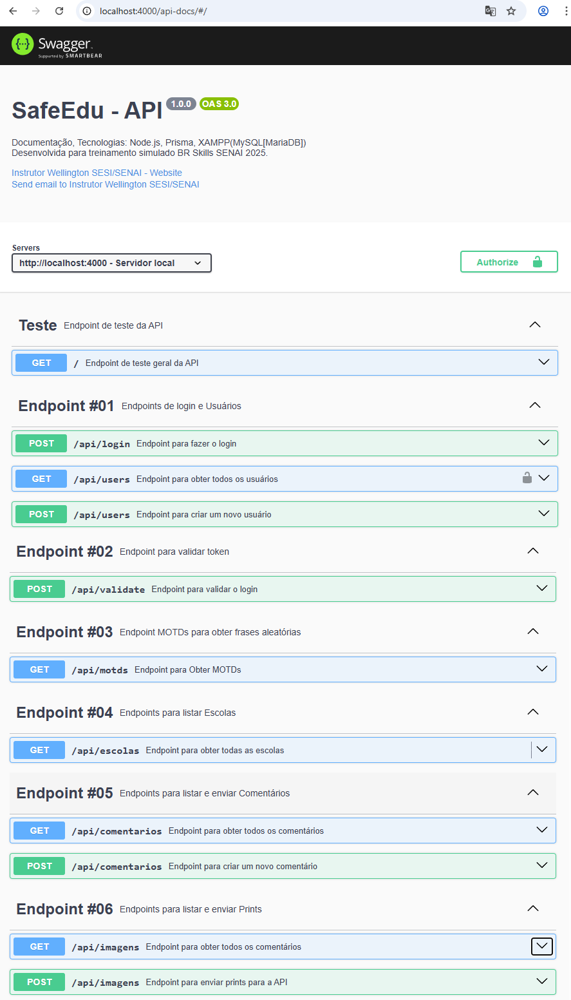

# SafeEdu - API

## Tecnologias
Para executar esta API é necessário ter o ambiente a seguir instalado:
- **[Node.js](https://nodejs.org/pt)**
- **[VsCode](https://code.visualstudio.com/download)**
- **[XAMPP](https://www.apachefriends.org/pt_br/index.html)**

## Para executar
- 0 Clone este repositório abra com VsCode, abra um terminal `CTRL + '` do tipo **CMD** ou **Git Bash**.
- 1 Instale as dependências, com o comando a seguir bi terminal:
```bash
npm install
```
- 2 Abra o **XAMPP** e inicie o **MySQL**.
- 3 Crie um arquivo chamado `.env` na raiz do projeto com o seguinte conteúdo:
```js
DATABASE_URL="mysql://root@localhost:3306/safeeduapi?schema=public&timezone=UTC"
PORT=4000
JWT_SECRET="my_jwt_secret"
```
- 4 Crie a migração do banco de dados para o XAMPP com o comando abaixo no terminal.
```bash
npx prisma migrate dev --name init
```
- 5 Execute a API com um os comandos a seguir:
```bash
npx nodemon
# ou
npm run dev
# ou
npm start
```
- 5 Acesse os links da documentação da API apresentados no console semelhante a este (http://localhost:4000/api-docs)
<br>
